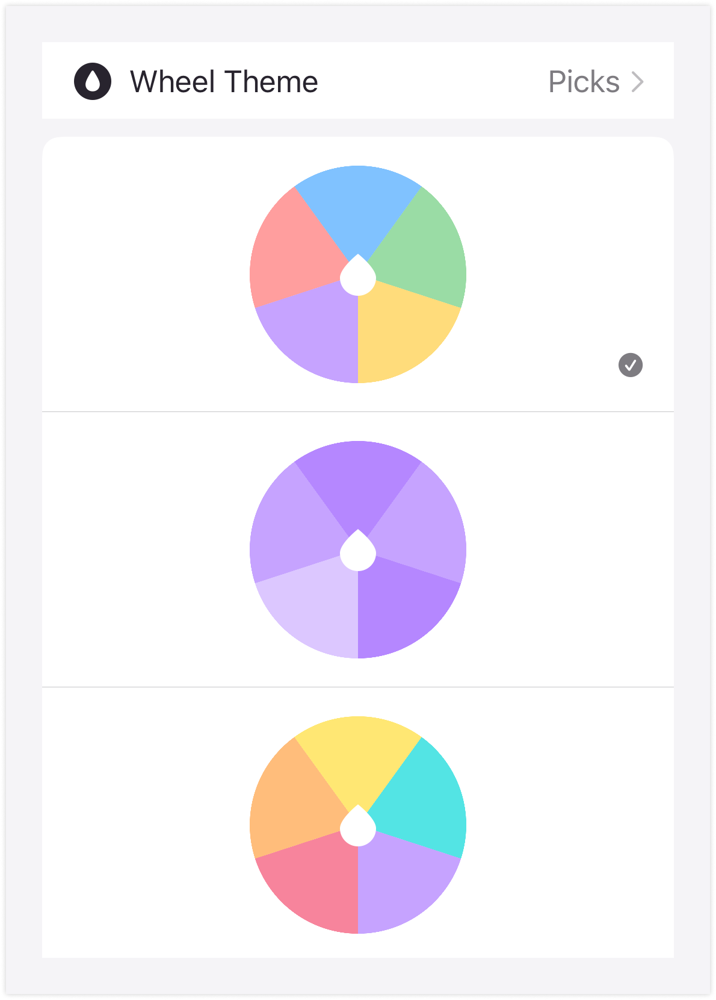

This release contains a new way to customize Picks! Now you can style your picker wheels with different color themes.

To change themes all you need to do is go to the settings page and select one of the eight available themes. More themes coming soon!

You may notice this update also added these patch notes that you're looking at. Now you can be informed about new changes and fixes with every new version.
